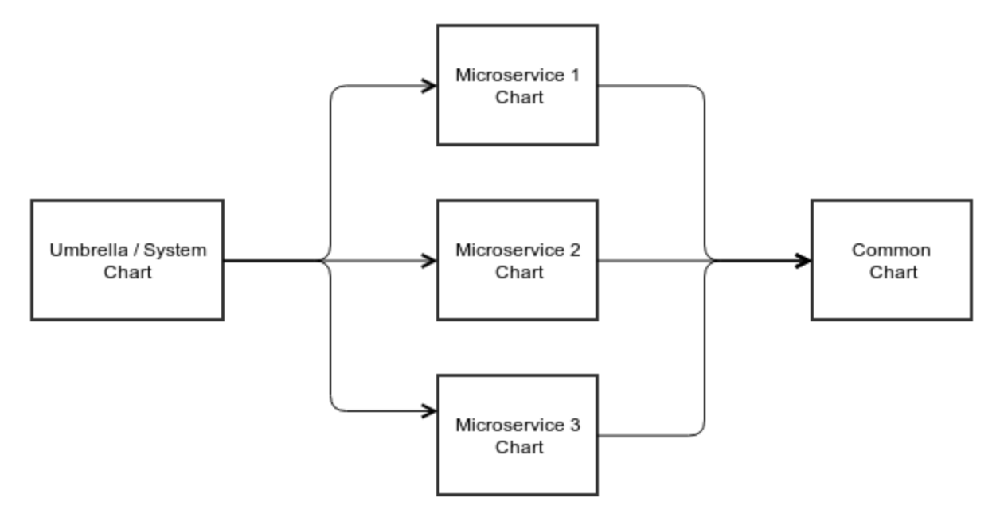

# helm\_to\_dry\_k8s
Example of how to DRY Kubernetes configuration files using Helm

## How it works

The `common_chart` holds the templates and default values for `deployments`, `services` and `jobs`.

The dependencies work this way:

## Setup

Run `helm dependency update` on `microservice_chart_1` since it depends on `common_chart` to package the contents of the subchart into its `charts/` folder.

## Useful Helm commands

- `helm dependency update`: Run on charts to update the dependencies (from the specified repository to their `charts/` directory), this needs to be run on the parent chart anytime a subchart is modified!

- `helm install --debug --dry-run --generate-name <path_to_chart>`: Lets you see the result of the templating engine working through your files without actually building the release.
